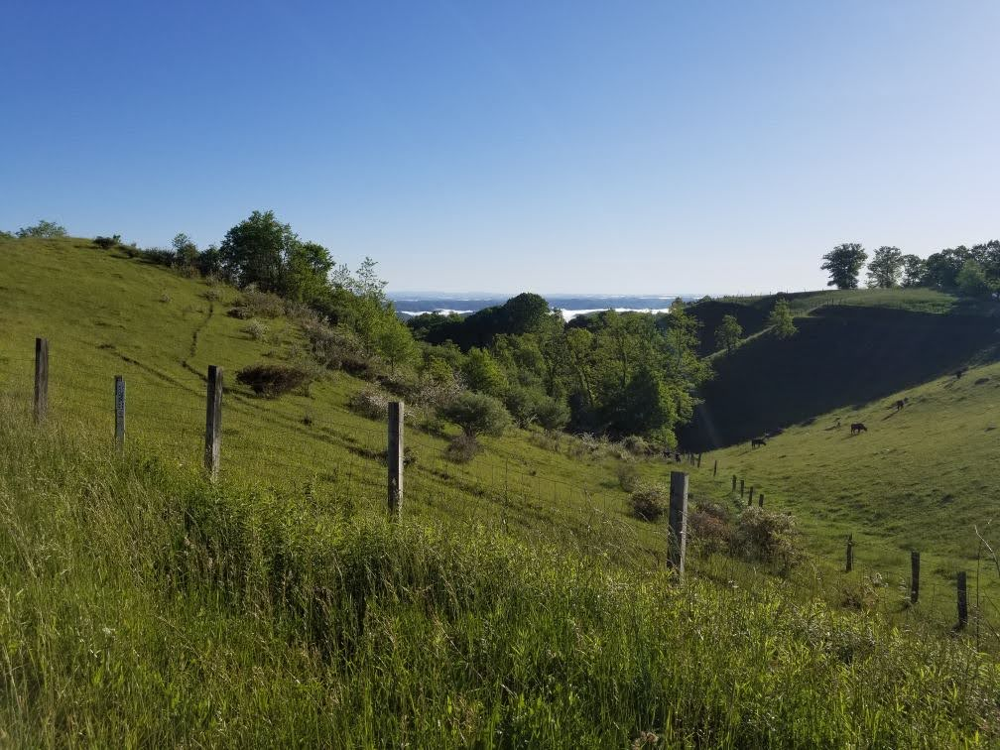

This post describes my participation in volunteer citizen science activity related to birding (bird watching) in Buchanan County, Virginia. Especially as highlighted by recent events, it is important to recognize the unearned privilege that I, as a white man receive in that I am able to go to public areas in the United States with a feeling of welcome and safety. Better than my description, read the [interview](https://www.nytimes.com/2020/05/27/nyregion/amy-cooper-christian-central-park-video.html) transcription from Christian Cooper who was accosted in New York's Central Park while birding. The consequences of racism in this country are serious. Ahmaud Arbery was [murdered](https://www.nytimes.com/article/ahmaud-arbery-shooting-georgia.html) in Georgia while jogging. And the arrival of the police can result in death, as it did for [George Floyd](https://www.nytimes.com/2020/05/31/us/george-floyd-investigation.html). I on the other hand have received only polite inquiries and even offers of assistance while doing this citizen science project. *It is my fervent desire that anyone regardless of race or gender be able to feel at least as safe and welcome as I have in visiting these beautiful parts of Virginia.* While performing this volunteer work, I also shared and encouraged participation in [Black Birders Week](https://www.npr.org/2020/06/03/869052336/-blackbirdersweek-seeks-to-make-the-great-outdoors-open-to-all) with other atlas volunteers and my social media outlets. 

## Acknowledgments

I am grateful to Buchanan County standout birders Daryl Owens and Roger Mayhorn. Daryl wrote an excellent [description](https://birdingvirginia.org/buchanan) of area birding, and Roger is the president of the [Buchanan County Bird Club](https://sites.google.com/site/buchananbirds/). Both Daryl and Roger provided welcome assistance in best access to locations in the area. Roger invited me to visit his gorgeous yard and property which he has transformed over time into a haven for birds with native plantings and bird-friendly features. We were all three able to visit while maintaining appropriate distance (because of COVID-19).

## Introduction

While world and national events have taken on greatest importance on this trip, I have continued the volunteer effort I started while also supporting #BlackBirdersWeek. Highlights of the trip included:

* Finding the first Alder Flycatcher reported on eBird for the county
* Making some mistakes and hopefully learning from them
* Getting to meet some great people
* Listening and learning from black voices

### The 2nd Virginia Breeding Bird Atlas 

The 2nd Virginia Breeding Bird Atlas[(VABBA2)](https://ebird.org/atlasva/home) is a five year (2016-2020) statewide effort to understand the distribution of different bird species across the state. VABBA2 is funded and supported by the Virginia Department of Game and Inland Fisheries (VDGIF), as well as the Virginia Society of Ornithology
(VSO). The first atlas was performed between 1985 and 1989. My involvement with the project started in earnest in the 2nd year of the project (2017) when Susan Babineau (spouse) and I started volunteering by going to different areas and documenting (using a protocol, apps, and online tools provided by the project) what birds we saw and whether they were exhibiting any breeding behavior. Birding is focused on priority blocks distributed evenly and randomly across 1/6 of the surface of Virginia.

### Buchanan County

[Buchanan county](https://en.wikipedia.org/wiki/Buchanan_County,_Virginia) is located in the western part of the state bordering both West Virginia and Kentucky. From a birding perspective, it offers plenty of mountainous woodland at medium elevation for the area. It is also interesting from the perspective that as a coal region county, significant surface mining has been performed in the area and some of the surface mines, no longer active, have been repurposed for recreational (and some wildlife) use. One of those areas was in a Priority Block that will be discussed in this series of posts. These recovered areas are flatter and have successional habitat different than the surrounding woodlands. In one area, recovery includes [reintroduciton of Elk](https://www.yesmagazine.org/issue/dirt/2019/04/13/land-recovery-elk-wildlife-habitat-appalachia/) after being extirpated in Virginia 100 years ago.

## Volunteer focus

The objective in going to Buchanan county was to assist the birders living in the area with the monumental task of surveying the priority blocks of the county. Counties with more residents, and therefore more birders, are well covered after four years of atlassing, but counties with fewer residents still need more volunteer effort. 

Priority Blocks require a certain amount of attention before being considered "complete." Once complete, no more effort is required in that block and atlassers are meant to focus their attention elsewhere. Of course if one happens to notice breeding confirmation in a "complete" block, one should still enter it. For example, the block Susan and I live in is considered complete but when we found a red-shouldered hawk nest in the neighborhood, we still added it. The [2020 summer blockbusting completion criteria](https://ebird.org/atlasva/news/volunteer-guidance-for-final-2020-field-season) are:

1. Daytime survey effort – a minimum of 8 hours of birding
1. Breeding species list – 60+ potential breeders
1. Breeding codes – 60% of species in either the probable or confirmed breeding category
1. Nocturnal effort –one hour of effort (ideally one spring visit for owls and one summer visit for nightjars)
1. Habitats – visit all major habitat types present in block

With these in mind, the first three blocks in the table were identified for the week's focus. I would also visit additional blocks as time permitted with Prater SE being a block that might get extra focus.

| Block | Prior Daytime Effort (hrs) | Prior Breeding Species Count | Prior % Prob+Confirmed | Final Daytime Effort(hrs) | Final Breeding Species Count | Final % Probable+Confirmed | Nightjar Survey |
| ------------ | ----------- | ----------- | ----------- | ----------- | ----------- | ----------- | ----------- |
| Bradshaw SE  | 0.47 | 28 | 18% | TBD | TBD | TBD | TBD |
| Harman SE    | 1.9  | 45 | 22% | TBD | TBD | TBD | TBD |
| Patterson SE | 2.8  | 61 | 46% | TBD | TBD | TBD | NA |
| *Prater SE*  | 1.63 | 27 | 19% | TBD | TBD | TBD | TBD |

The table will be completed in a future post [See](). This effort will also include a nighttime nightjar survey of those blocks except for Patterson SE because another birder has performed surveys in the block but they are not yet in the dataset. In the next post, I will describe the surprise I had when I heard what I thought was an Adler Flycatcher.

As I write this post, the trip is nearly over. Overall my thoughts keep returning to the importance of the focus that #BlackBirdersWeek brings to the fact that not everyone could do a trip with the same feeling of safety and welcome that I have felt. It is my fervent hope that all may be able to do so soon.
