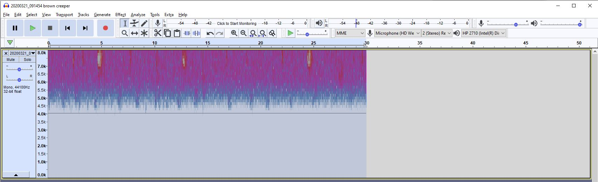

I talked in an earlier [post](2020-2-8-RecordingBirdSounds.md) about recording bird sounds. This post talks about editing them once recorded. This is not a step by step tutorial but does give ideas which should help a person edit their own recordings for adding to eBird.

I was doing chores this morning in our back yard, which simultaneously listening to the birds. I did record a few of the birds. One was a brown creeper. I have an android phone and used the free 'RecForge' App. After recording I finished the chores. Later I headed inside, emailed the resulting .wav file from my phone to myself. That allowed me to open my email on my PC, save the file and open it with 'Audacity', a free
audio editing program. Then I added it to this eBird which also goes into the Macaulay library. Click [here](https://macaulaylibrary.org/asset/216933511) to hear the results. You will need to be able to hear high frequencies to hear this.

## Changing to a spectogram

When you bring up the wav file in audacity. It first looks like this:

Select Spectogram on the view window to the left and it will look like this:

## Clipping the sound to the portion of the recording you want

Now I can see some interesting things. The brown creeper has a very high pitched call. Three calls can be seen at 12, 20 and 32 seconds.
But there was some noise while I was starting and ending the recording so I want to cut that out. I wil cut out the first 7 seconds and the last 10 seconds.

## Using a filter to get the frequency of interest

The spectogram shows a lot of sounds at the lower end of the frequency. Road noise and other people sounds are down there but bird song rarely is. Normally you can always eliminate frequencies below 400 Hz for song birds without losing any of their sounds. But the creepers sounds are at a very high frequency, above 6500 Hz.

A carolina wren is also singing at around 11 seconds.

So we can safely edit out frequencies below 6000 Hz using a High Pass Filter. THe High Pass Filter passes every sound that is a higher frequency than what we specify. I will specify 6000 Hz. I specified the rolloff at 48 dB to filter the most sound as allowed by this filter.

Note that for birds with lower pitched songs, we could also use a low pass filter to filter out everything lower than the value we specify. That is not useful for a brown creeper though!

## Normalizing the sound

Now that I have the time and frequency of interest, I can normalize the sound that is left so that it can be heard at a consistent volume on eBird/Macaulay Library. The Macaulay library asks that we setting the peak level of our recordings to -3 dB. THis is easily done in Audacity by going to effects and selecting Normalize and setting peak amplitude to -3 dB.

## All done

Thats all there is, then save the results as a .wav file and add to your eBird [list](https://ebird.org/checklist/S66039216).
